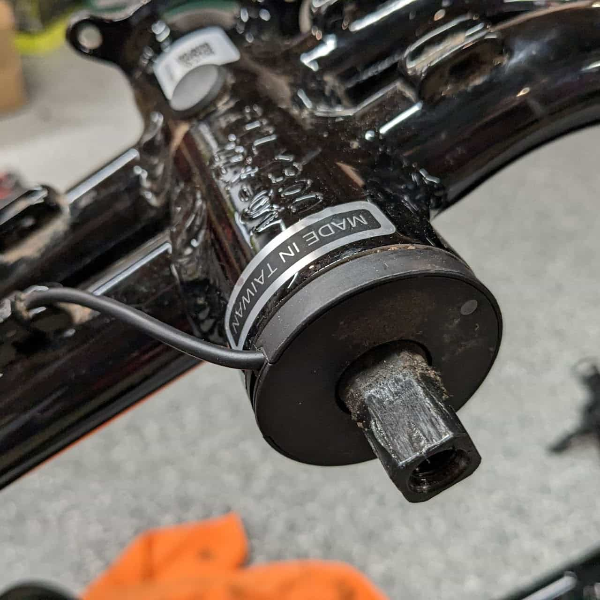
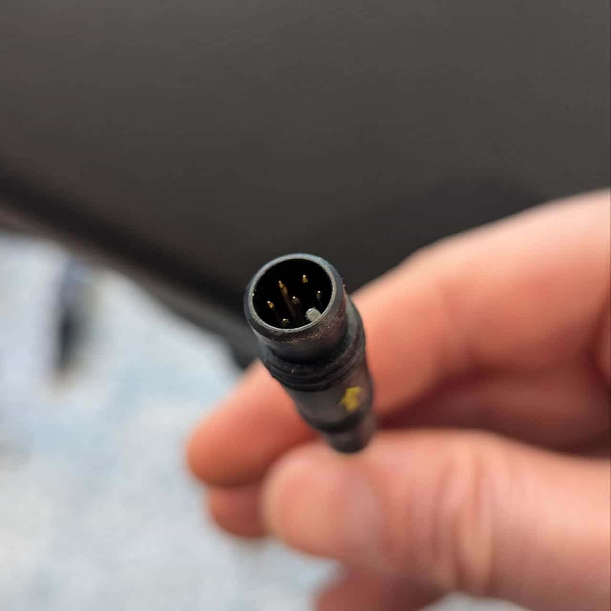
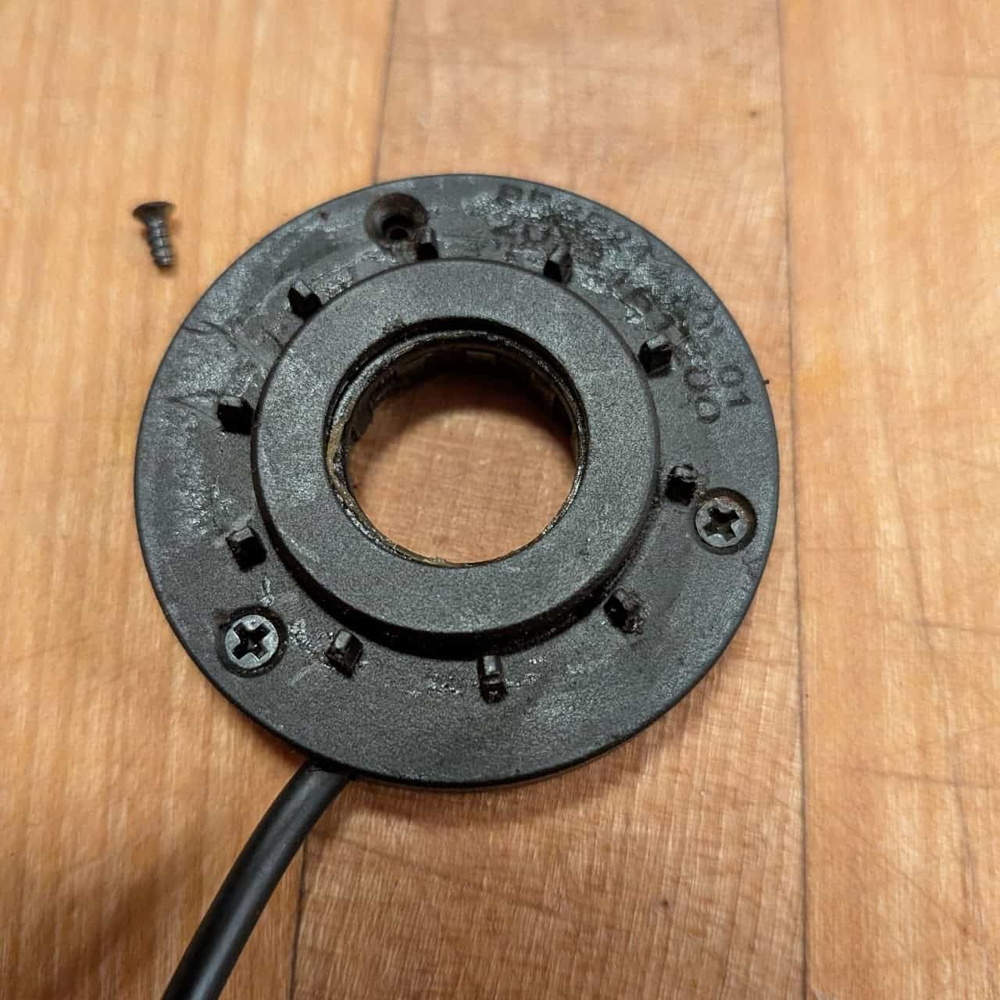
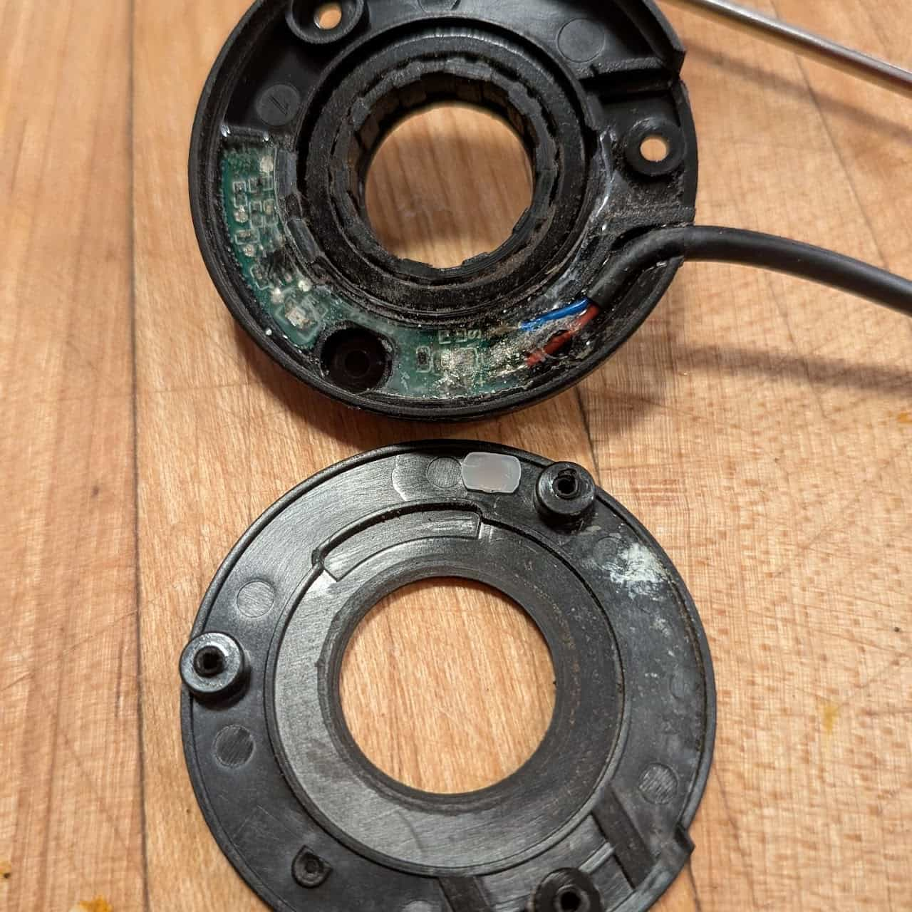
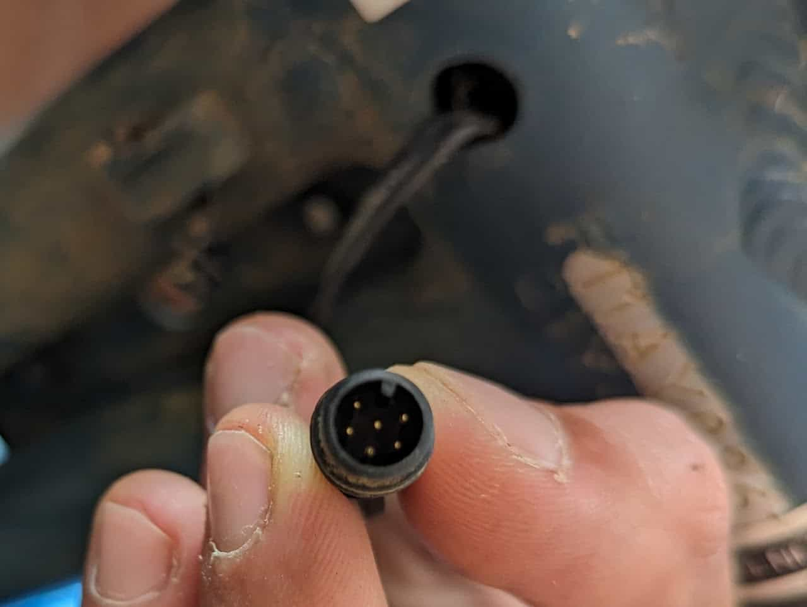
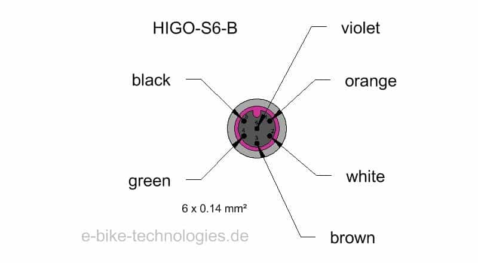

## Cadence sensor

Standard in US RX bikes.

Installation position. Red light will turn on when bike is on and cranks are turned.

6 pole Higo Mini B connector

Faulty sensor, note the rust, part number BBSS24-L50L-01

That white stuff is good, right?

# Cadence Sensor Failure

They don't like water.

## Torque Sensor

### Torque sensor connector

1. Unknown (~5V)
2. Unknown (~5V)
3. Unknown
4. Unknown (~6V)
5. GND
6. Unknown (GND?)
